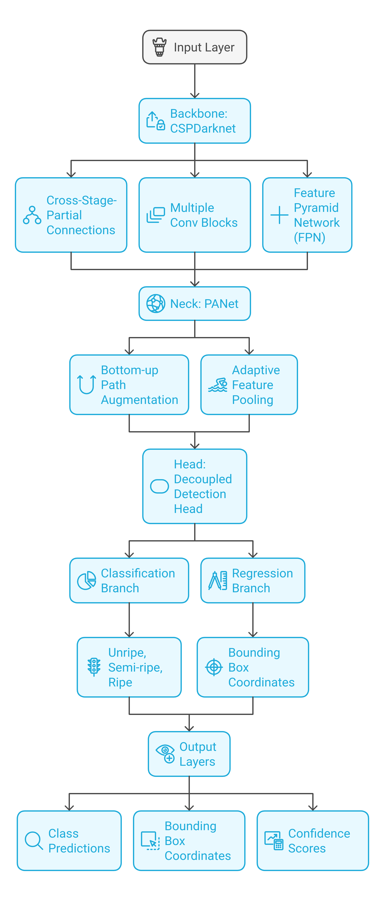

# 🍅 Cherry Tomato Sorting System

An intelligent computer vision system for automated cherry tomato sorting based on ripeness and size using YOLOv11 and Streamlit.

## 📝 Overview

This project implements a real-time cherry tomato sorting system that:

- Detects and classifies cherry tomatoes by ripeness level (Unripe, Semi-ripe, Ripe)
- Measures tomato sizes and categorizes them (Small, Medium, Large)
- Provides real-time analytics and visualization
- Supports IP camera integration for continuous monitoring

## 🎥 Demo

<video controls width="100%">
  <source src="./assets/demo.mp4" type="video/mp4">
  Your browser does not support the video tag.
</video>

## 🔧 Features

### Real-time Detection

- Process live video feed from IP cameras
- Dynamic bounding boxes with rich labels showing:
- Ripeness classification
- Size measurements
- Confidence scores

### Multi-class Classification

- **Unripe (Green)**: Early stage tomatoes
- **Semi-ripe (Orange)**: Transitioning tomatoes
- **Ripe (Bright Red)**: Fully ripened tomatoes

### Size Categorization

- **Small**: < 20mm diameter
- **Medium**: 20-25mm diameter
- **Large**: > 25mm diameter

### Live Analytics Dashboard

- Total tomato count
- Color distribution charts
- Size distribution metrics
- Real-time performance stats

## 🛠️ Technologies Used

- **Python 3.8+**: Core programming language
- **YOLOv11**: Object detection & classification
- **Streamlit**: Interactive web interface
- **OpenCV**: Image processing & camera integration
- **Plotly**: Data visualization
- **NumPy**: Numerical operations

## 📦 Installation

```bash
# Clone repository
git https://github.com/abdellatif-laghjaj/tomato-sorting-using-CNN
cd tomato-sorting-using-CNN

# Create virtual environment
python -m venv venv

# Activate environment
source venv/bin/activate  # Linux/Mac
# or
venv\Scripts\activate  # Windows

# Install dependencies
pip install -r requirements.txt
```

## 💻 Usage

1. **Start the Streamlit app:**

```bash
streamlit run app.py
```

2. **Configure settings in sidebar:**

- Enter IP camera URL
- Adjust processing parameters if needed

3. **Click "Start Processing" to begin detection**
4. **View real-time results:**

- Live video feed with detections
- Dynamic analytics charts
- Running metrics

## 🤖 Model Architecture

- **Network Structure**



```bash
Input Layer (640x640x3)
    │
    ▼
Backbone: CSPDarknet
    │    ├── Cross-Stage-Partial Connections
    │    ├── Multiple Conv Blocks
    │    └── Feature Pyramid Network (FPN)
    │
    ▼
Neck: PANet (Path Aggregation Network)
    │    ├── Bottom-up Path Augmentation
    │    └── Adaptive Feature Pooling
    │
    ▼
Head: Decoupled Detection Head
    │    ├── Classification Branch (3 classes)
    │         └── [Unripe, Semi-ripe, Ripe]
    │    └── Regression Branch
    │         └── [Bounding Box Coordinates]
    │
    ▼
Output Layers
    ├── Class Predictions
    ├── Bounding Box Coordinates
    └── Confidence Scores
```

- **Training Configuration**

```python
model.train(
    data=data_yaml_path,
    epochs=50,
    imgsz=640,
    batch=16,
    name="cherry_tomato_sorting"
)
```

## 🤝 Contributing

Fork repository
Create feature branch (git checkout -b feature/AmazingFeature)
Commit changes (git commit -m 'Add some AmazingFeature')
Push to branch (git push origin feature/AmazingFeature)
Open Pull Request

## 🙏 Acknowledgments

OpenCV community for computer vision tools
Ultralytics for YOLOv11 framework
Streamlit team for the amazing dashboard framework
